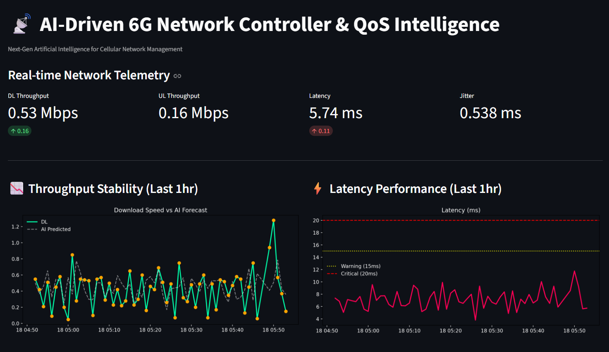

# AI-Driven 6G Network Controller & QoS Intelligence 📡

AI-powered Quality of Service (QoS) monitoring and prediction for next-generation cellular networks.


## Features

### 📊 Network Health Monitor
- Real-time telemetry dashboard (Throughput, Latency, Jitter)
- **AI Anomaly Detection**: Automatic alerts when latency exceeds thresholds
- Cyberpunk-themed dark UI for operations center feel

### 🚀 QoS Future Forecast
- Predicts **Downlink Throughput** for the next 60 minutes
- Recursive XGBoost model with confidence intervals
- Helps network operators proactively manage congestion
## 📸 Dashboard Preview



## 📂 Dataset Source
This project uses real-world 5G traffic data:
- **Source**: [5G Traffic Datasets (Kaggle)](https://www.kaggle.com/datasets/0913ktg/5g-traffic-datasets)
- **Content**: Packet-level traces from South Korea (2022) converted to throughput metrics.
- **Traffic Types**: Zoom, Netflix, YouTube, and YouTube Live.

## 🛠️ Installation & Usage

```bash
# 1. Install dependencies
pip install -r requirements.txt

# 2. Generate mock data & train model
python train_model.py

# 3. Launch dashboard
streamlit run app.py
```

## Project Structure

```
├── app.py              # Streamlit Dashboard
├── load_data.py        # Data generation & loading
├── train_model.py      # ML training pipeline
├── model_6g.pkl        # Trained XGBoost model
├── network_traffic_6g.csv  # Simulated 6G data
└── test_results_6g.csv # Model evaluation results
```

## 🧠 AI Methodology
The system follows a predictive analytics pipeline:
1.  **Packet Aggregation**: Raw PCAP data is aggregated into 1-minute intervals.
2.  **Feature Engineering**: Extraction of temporal features and network context.
3.  **Recursive Forecasting**: An XGBoost regressor predicts future steps iteratively.

## 📡 Key 6G Metrics Explained
- **Throughput (Mbps/Gbps)**: The volume of data successfully transmitted.
- **Latency (ms)**: The time delay for data packets.
- **Jitter (ms)**: The variation in latency.

## Model Performance

| Metric | Value |
|--------|-------|
| MAE | 0.02 - 0.18 Mbps |
| R² Score | Up to 0.37 |
| Prediction Window | 60 Minutes |

## 🔮 Future Enhancements
- **Dynamic Slicing**: AI-driven resource allocation based on predicted traffic.
- **Multivariate Forecasting**: Incorporate signal strength (RSRP) and interference (SINR) metrics.
- **Deployment**: containerization using Docker for cloud-native deployment.

## Tech Stack
- **Python 3.10+**
- **Pandas / NumPy** - Data manipulation
- **Scikit-Learn** - Machine Learning (HistGradientBoostingRegressor)
- **Streamlit** - Dashboard UI
- **Matplotlib** - Visualization

## 📝 Author
- **Rapeenut** - Telecommunication Engineering Student @King Mongkut's University of Technology Thonburi
- [GitHub Profile](https://github.com/Rapeenut14)

## License
MIT License - Free for educational and commercial use.
